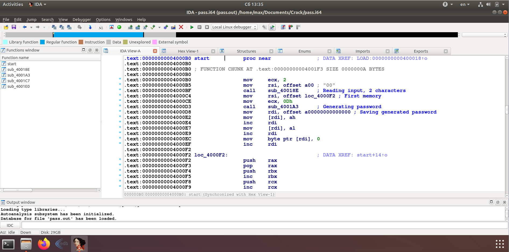
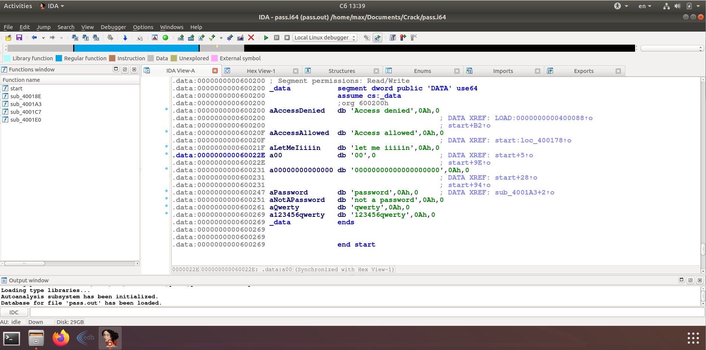
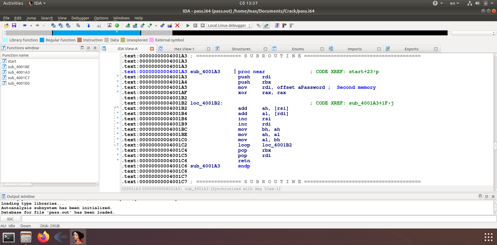
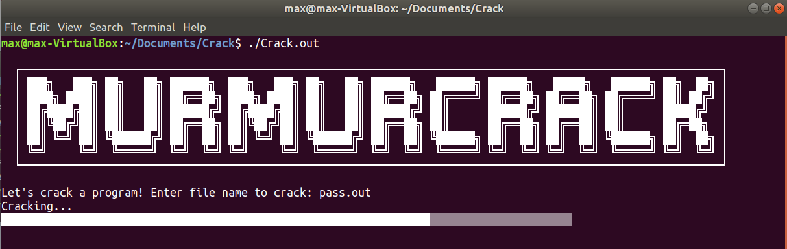
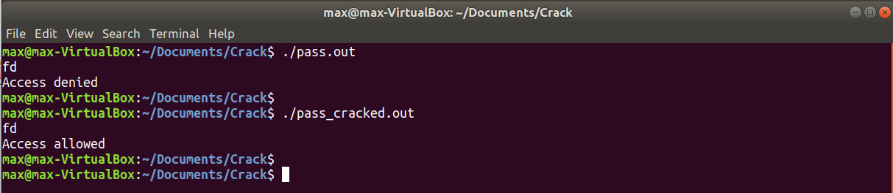

# Crack

In this project we are going to crack friend program that asks for a password.

## Disassembling

Let's disassemble the program! We use IDA for it.

At the beginning of the program we see the folowing code:

Two functions are called here. The first one is the input function. It reads 2 characters and writes them to a00:

Let's see the second function:

As we can see it generates a 2-character password based on two memory blocks.

## Cracking

Now if we set the first memory block to the address of second character of the input buffer and the second block - to the first character, the password generator function will generate exactly the same password as was read from user.

The program that will do works the following way:

## Results

Before cracking the program didn't let us in if we type a random password. But after we cracked it it lets us in with any password:

